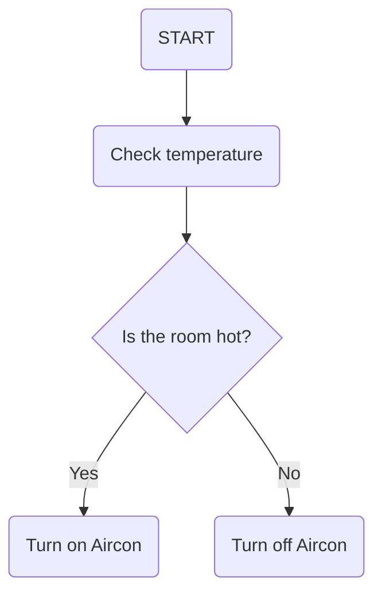

# Pine :evergreen_tree:

 > A simple infrared controller

 ## Components

 - Microcontroller **ATMSAMD21G**
 - IR RED emitter


 ## Input voltage
 | Components | Voltage |
 | ------ | ------ |
 | Mcu | `1.62V` to `3.63V` |


 ## Design
> Mermaid js



## Infrared sensor

### Wavelength equation
> Mathjax

$$\lambda = \frac{v}{f} $$

### Infrared range test

> D3 js

```vega-lite
{
    "mark":"line",
    "data": {
        "url": "range1.csv"
    },
    "encoding":{
        "x":{
            "field":"resistance(ohm)",
            "type":"quantitative"
        },
        "y":{
            "field":"distance(cm)",
            "type":"quantitative"
        }
    }
}
```


## Temperature sensor

### I2C protocol

```sequence
MCU -> Sensor: Start
MCU -> Sensor: Slave address
Sensor --> MCU: Ack
MCU -> Sensor: Data
Sensor --> MCU: Ack 
```


